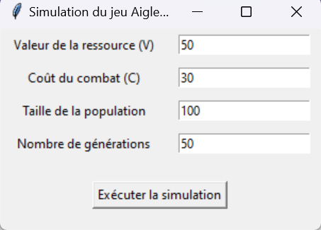
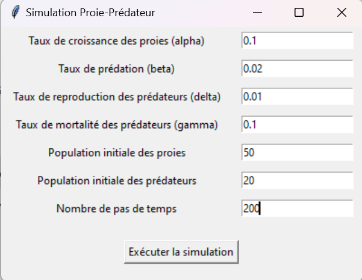

# **Applications de la théorie des jeux à la Biologie**

Ce projet explore les différentes applications de la **théorie des jeux** dans le domaine de la **biologie évolutive**. Chaque sous-sujet est implémenté dans un fichier Python indépendant, permettant de simuler et de visualiser des dynamiques biologiques complexes.

---

## **Sous-Sujet : Les stratégies évolutionnistes stables (ESS)**
### Basée sur le jeu "Aigle-Colombe"

**Fichier Python correspondant :** `evolution_stable.py`

### **Résumé**
Le jeu **"Aigle-Colombe"** simule une dynamique évolutive dans laquelle deux stratégies, **"Aigle"** (agressive) et **"Colombe"** (passive), interagissent pour maximiser leurs gains dans un contexte de partage de ressources limitées.

Les interactions sont modélisées à l'aide d'une **matrice de payoffs** :
- **Aigle** vs **Aigle** : conflit coûteux.
- **Aigle** vs **Colombe** : l'Aigle gagne toujours.
- **Colombe** vs **Colombe** : partage égal des ressources.

Au fil des générations, les proportions des deux stratégies évoluent en fonction des résultats des interactions, convergeant vers un **équilibre stable** ou produisant des **fluctuations dynamiques** dans la population.

---

### **Démarrage de la simulation**
Après avoir run le fichier `evolution_stable.py`, vous pouvez remplir l'**interface graphique** avec les paramètres suivants :

1. **Valeur de la ressource :**
    - La valeur totale de la ressource à partager entre les Aigles et les Colombes.

2. **Coût du combat :**
    - Le coût d'un conflit lorsque deux Aigles se rencontrent.

3. **Taille de la population :**
    - Le nombre total d'individus (Aigles + Colombes) dans la simulation.

4. **Nombre de générations :**
    - Le nombre de générations à simuler. À chaque génération, les proportions des stratégies dans la population changent en fonction des payoffs obtenus.

---

### **Exemple d'interface graphique**

---

### **Visualisation des résultats**
La simulation génère deux visualisations :
1. **Évolution des stratégies** :  
   Un graphique montrant la proportion d'Aigles dans la population au fil des générations.

2. **Matrice des payoffs** :  
   Une représentation visuelle des gains obtenus par les interactions entre les stratégies.

---

## **Sous-Sujet : Modèle Proie-Prédateur avec Matrice de Payoffs**
### Basé sur le modèle de Lotka-Volterra

**Fichier Python correspondant :** `modele_demo_proie_predateur.py`

### **Résumé**
Ce sous-sujet implémente le modèle **Lotka-Volterra**, une description mathématique des interactions entre une population de **proies** et de **prédateurs**. Nous enrichissons le modèle classique en intégrant une **matrice de payoffs**, qui évalue les gains (ou pertes) liés aux interactions suivantes :

- **Proie-Proie :** croissance naturelle.
- **Proie-Prédateur :** diminution des proies en raison de la prédation.
- **Prédateur-Proie :** augmentation des prédateurs par reproduction liée à la disponibilité des proies.
- **Prédateur-Prédateur :** mortalité naturelle des prédateurs.

Ce modèle permet d'observer les dynamiques complexes entre deux populations et d'identifier les conditions favorisant des oscillations stables ou l'extinction d'une population.

---

### **Démarrage de la simulation**
Pour exécuter le fichier `modele_demo_proie_predateur.py`, vous devez remplir l'**interface graphique** avec les paramètres suivants :

1. **Taux de croissance des proies (alpha) :**
    - Le taux naturel de croissance de la population des proies.

2. **Taux de prédation (beta) :**
    - La proportion de proies capturées par les prédateurs.

3. **Taux de reproduction des prédateurs (delta) :**
    - La contribution des proies capturées à la reproduction des prédateurs.

4. **Taux de mortalité des prédateurs (gamma) :**
    - Le taux de diminution naturelle de la population des prédateurs.

5. **Population initiale des proies :**
    - Le nombre initial d'individus dans la population des proies.

6. **Population initiale des prédateurs :**
    - Le nombre initial d'individus dans la population des prédateurs.

7. **Nombre de pas de temps :**
    - Le nombre total d'itérations pour observer les interactions.

---

### **Exemple d'interface graphique**

---

### **Visualisation des résultats**
La simulation produit deux visualisations principales :

1. **Évolution des populations :**  
   Un graphique montrant les variations des populations de proies (en vert) et de prédateurs (en rouge) au fil du temps.

2. **Matrice des payoffs :**  
   Une représentation des gains et pertes accumulés pour chaque interaction (proie/prédateur).

