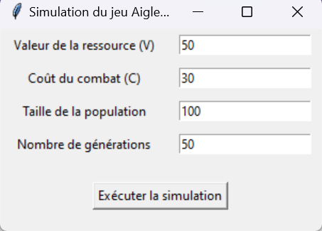
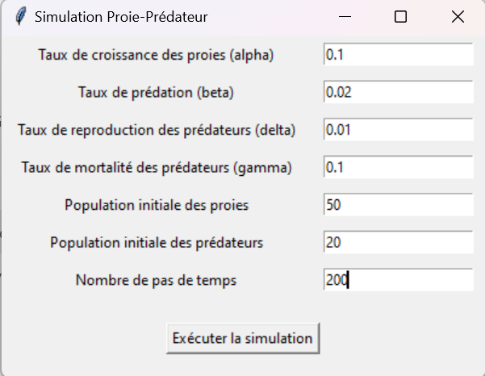

# **Applications de la théorie des jeux à la Biologie**

Ce projet explore les différentes applications de la **théorie des jeux** dans le domaine de la **biologie évolutive**. Chaque sous-sujet est implémenté dans un fichier Python indépendant, permettant de simuler et de visualiser des dynamiques biologiques complexes.

---

## **Sous-Sujet : Les stratégies évolutionnistes stables (ESS)**
### Basée sur le jeu "Aigle-Colombe"

**Fichier Python correspondant :** `evolution_stable.py`

### **Résumé**
Le jeu **"Aigle-Colombe"** simule une dynamique évolutive dans laquelle deux stratégies, **"Aigle"** (agressive) et **"Colombe"** (passive), interagissent pour maximiser leurs gains dans un contexte de partage de ressources limitées.

Les interactions sont modélisées à l'aide d'une **matrice de payoffs** :
- **Aigle** vs **Aigle** : conflit coûteux.
- **Aigle** vs **Colombe** : l'Aigle gagne toujours.
- **Colombe** vs **Colombe** : partage égal des ressources.

Au fil des générations, les proportions des deux stratégies évoluent en fonction des résultats des interactions, convergeant vers un **équilibre stable** ou produisant des **fluctuations dynamiques** dans la population.

---

### **Démarrage de la simulation**
Après avoir run le fichier `evolution_stable.py`, vous pouvez remplir l'**interface graphique** avec les paramètres suivants :

1. **Valeur de la ressource :**
    - La valeur totale de la ressource à partager entre les Aigles et les Colombes.

2. **Coût du combat :**
    - Le coût d'un conflit lorsque deux Aigles se rencontrent.

3. **Taille de la population :**
    - Le nombre total d'individus (Aigles + Colombes) dans la simulation.

4. **Nombre de générations :**
    - Le nombre de générations à simuler. À chaque génération, les proportions des stratégies dans la population changent en fonction des payoffs obtenus.

---

### **Exemple d'interface graphique**

---

### **Visualisation des résultats**
La simulation génère deux visualisations :
1. **Évolution des stratégies** :  
   Un graphique montrant la proportion d'Aigles dans la population au fil des générations.

2. **Matrice des payoffs** :  
   Une représentation visuelle des gains obtenus par les interactions entre les stratégies.

---

## **Sous-Sujet : Modèle Proie-Prédateur**
### Basé sur le modèle de Lotka-Volterra

**Fichier Python correspondant :** `modele_demo_proie_predateur.py`

### **Résumé**
Ce sous-sujet implémente le modèle **Lotka-Volterra**, une description mathématique des interactions entre une population de **proies** et de **prédateurs**. Nous enrichissons le modèle classique en intégrant une **matrice de payoffs**, qui évalue les gains (ou pertes) liés aux interactions suivantes :

- **Proie-Proie :** croissance naturelle.
- **Proie-Prédateur :** diminution des proies en raison de la prédation.
- **Prédateur-Proie :** augmentation des prédateurs par reproduction liée à la disponibilité des proies.
- **Prédateur-Prédateur :** mortalité naturelle des prédateurs.

Ce modèle permet d'observer les dynamiques complexes entre deux populations et d'identifier les conditions favorisant des oscillations stables ou l'extinction d'une population.

---

### **Démarrage de la simulation**
Pour exécuter le fichier `modele_demo_proie_predateur.py`, vous devez remplir l'**interface graphique** avec les paramètres suivants :

1. **Taux de croissance des proies (alpha) :**
    - Le taux naturel de croissance de la population des proies.

2. **Taux de prédation (beta) :**
    - La proportion de proies capturées par les prédateurs.

3. **Taux de reproduction des prédateurs (delta) :**
    - La contribution des proies capturées à la reproduction des prédateurs.

4. **Taux de mortalité des prédateurs (gamma) :**
    - Le taux de diminution naturelle de la population des prédateurs.

5. **Population initiale des proies :**
    - Le nombre initial d'individus dans la population des proies.

6. **Population initiale des prédateurs :**
    - Le nombre initial d'individus dans la population des prédateurs.

7. **Nombre de pas de temps :**
    - Le nombre total d'itérations pour observer les interactions.

---

### **Exemple d'interface graphique**

---

### **Visualisation des résultats**
La simulation produit deux visualisations principales :

1. **Évolution des populations :**  
   Un graphique montrant les variations des populations de proies (en vert) et de prédateurs (en rouge) au fil du temps.

2. **Matrice des payoffs :**  
   Une représentation des gains et pertes accumulés pour chaque interaction (proie/prédateur).

## **Sous-Sujet 2 : analyse de la dominance sociale au sein des espèces**

Ce projet simule les dynamiques d'une population d'individus compétiteurs où les interactions sont modélisées selon des mécanismes d'évolution des rangs de dominance, capacités de combat, et coûts cumulés associés aux affrontements.

L'objectif est de comprendre les facteurs qui influencent la structure sociale d'une population (dominance et subordination), d'analyser les stratégies individuelles dans un cadre compétitif, et d'explorer les conséquences à long terme des interactions fréquentes ou rares.

Les principaux graphiques produits illustrent :

L'évolution des rangs de dominance : Comment les individus se hiérarchisent au fil des générations.
L'évolution des coûts cumulés : Le "prix" payé par chaque individu pour maintenir ou améliorer sa position.
L'évolution des capacités de combat : La force relative des individus en tant que facteur clé des interactions.

1. Rangs de dominance

Le rang d’un individu détermine sa position dans une hiérarchie sociale. Plus le rang est faible, plus l’individu est dominant. Les individus dominants (rangs proches de 0) tirent un avantage significatif dans un cadre compétitif, car :

Ils subissent moins de défis,
Ils gagnent plus souvent les combats,
Leur position tend à être plus stable.

Les individus de rang élevé (subordonnés) doivent fréquemment engager des combats pour améliorer leur position ou conserver un rang intermédiaire.

Intérêt :
Cette dynamique est directement inspirée des interactions observées dans des systèmes biologiques tels que les groupes sociaux d’animaux (par exemple, meutes de loups, groupes de primates), où la hiérarchie a des implications sur l’accès aux ressources, aux partenaires, ou sur la survie.

2. Coûts cumulés

Les combats ne sont pas gratuits. Chaque affrontement impose un coût (énergie, blessures, etc.), ce qui limite les capacités des individus à interagir fréquemment ou à maintenir une position dominante.

Dans la simulation :

Les coûts augmentent lorsque les individus perdent des combats,
Les coûts peuvent empêcher les individus de participer activement à des interactions,
Les individus incapables de compenser leurs coûts deviennent "inactifs" ou "meurent" dans le modèle.

Les coûts cumulés introduisent une contrainte réaliste, obligeant les individus à équilibrer leur agressivité avec leurs capacités à supporter les coûts.

3. Capacités de combat

La capacité de combat est une mesure de la "force" d’un individu dans une interaction donnée. Elle est influencée par les victoires et les défaites dans les combats, ainsi que par des mécanismes d'apprentissage ou d'adaptation :

Un individu qui gagne des combats peut voir sa capacité de combat augmenter.
À l'inverse, un individu affaibli par des défaites successives ou des coûts élevés verra sa capacité de combat diminuer.

Les capacités de combat fluctuent donc en fonction des interactions, créant des cycles dynamiques d'évolution au sein de la population.

La modélisation des capacités de combat permet d'étudier des comportements compétitifs tels que la prise de risques, la gestion de l'énergie, ou la stratégie passive pour éviter les conflits.
Fonctionnement de la simulation
Paramètres principaux

Nombre d’individus : La taille de la population simulée.
Durée (générations) : Le nombre total de générations simulées.
Coût par combat : Le coût imposé pour chaque combat.
Probabilité de combat : La probabilité qu’un individu interagisse avec un autre lors d’une génération donnée.
Facteurs de mise à jour des rangs et capacités de combat : Ces paramètres déterminent l’influence des victoires/défaites sur les rangs et capacités de combat.

Visualisations et interprétations
1. Évolution des rangs de dominance

Le premier graphique montre la position hiérarchique de chaque individu au fil des générations.
Observations possibles :
Les individus dominants (rangs proches de 0) tendent à stabiliser leur position rapidement.
Les individus de rangs intermédiaires subissent des fluctuations importantes, témoignant d’une compétition active.
Certains individus effectuent des "sauts" drastiques dans la hiérarchie, révélant des victoires exceptionnelles ou des défaites critiques.

2. Évolution des coûts cumulés

Le second graphique illustre la charge cumulée pour chaque individu en termes de coûts associés aux interactions.
Observations possibles :
Les individus inactifs (ceux qui n'interagissent pas) voient leurs coûts stagner.
Les individus engagés dans des combats fréquents accumulent rapidement des coûts, ce qui peut mener à leur disparition.
Certains individus continuent d’accumuler des coûts même après avoir "disparu" : cela peut refléter un bug dans la simulation ou une mémoire résiduelle.

3. Évolution des capacités de combat

Le dernier graphique montre comment la force relative des individus change au fil du temps.
Observations possibles :
Les individus dominants conservent souvent des capacités de combat élevées.
Les capacités peuvent chuter brutalement suite à des défaites successives, entraînant des changements de rang significatifs.
Les individus qui atteignent zéro sont éliminés, mais certains "rebondissent" grâce à des combats victorieux.

Relation entre les graphiques

Capacités de combat vs rangs de dominance : Une capacité de combat élevée est corrélée à un bon rang (proche de 0). Les sauts dans les capacités se traduisent directement par des changements de rangs.
Coûts cumulés vs capacités de combat : Les coûts augmentent pour les individus faibles (pertes fréquentes) ou hyperactifs (combats fréquents), ce qui peut affaiblir leurs capacités de combat.
Rangs stables et coûts faibles : Les meilleurs individus stabilisent leurs rangs en minimisant leurs combats (et donc leurs coûts).

Conclusions tirées de la simulation

Stabilité des dominants : Les individus dominants (meilleurs rangs) atteignent rapidement une position stable en limitant les combats risqués.
Volatilité des subordonnés : Les individus dans les rangs intermédiaires subissent les fluctuations les plus importantes, illustrant une compétition féroce dans la lutte pour la domination.
Coût de la compétition : Maintenir une position dominante ou intermédiaire implique un coût énergétique important. Ce coût peut limiter la capacité d’un individu à interagir ou le condamner à disparaître.
Équilibre dynamique : La population tend vers un équilibre où seuls les individus les plus adaptés survivent et prospèrent.